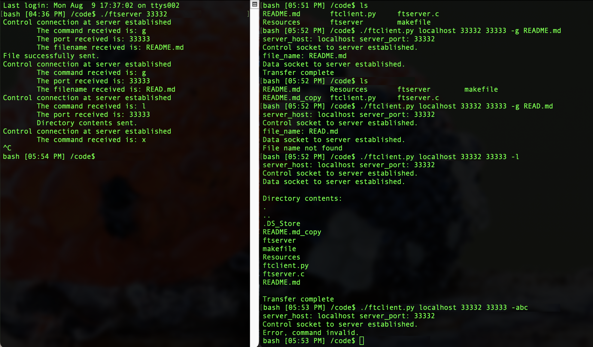

  #  File Transfer Protocol

  ###### FTP between client and server over control socket and a data socket

File transfer protocol between client and server using sockets API over two sockets. Program logic is handled on the control socket and data is transferred through the data socket. After a handshake on the control socket, the server verifies the client's request and either sends back a list of the current directory or a file through the data socket.

  ## Requirements

  - gcc compiler
  - POSIX compliant OS
  - python v3.9.5 or higher

  ## Usage

  Compile FTP server: `make`

  1. Start the FTP server first in it's own terminal. It waits for incoming connections and persists after handling client requests.

    `./ftserver <port number>`   

    e.g. `./ftserver 33332`

  2. Start the FTP client in a separate terminal. Request the directory list with `-l` or transfer a file with `-g`. After the request is make the connection closes. Port number 1 corresponds with the control socket and port number 2 corresponds with the data socket.

    a. Request the directory list

    * `./ftclient.py <host name> <port number 1> <port number 2> -l`

    * e.g. `./ftclient.py localhost 33332 33333 -l`

    b. Request a file transfer. If the requested file has the same name as another file, the client will append '_copy' to the name of the transferred file.

    *  `./ftclient.py <host name> <port number 1> <port number 2> -g <file name>`

    *  e.g. `./ftclient.py localhost 33332 33333 -g file1.txt`

  3. Close the server application with `ctrl-C`.

  ## Output

  
